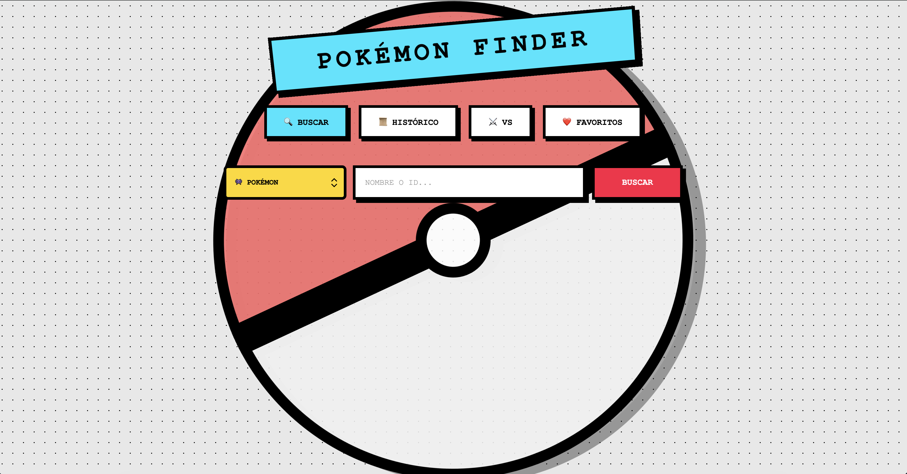
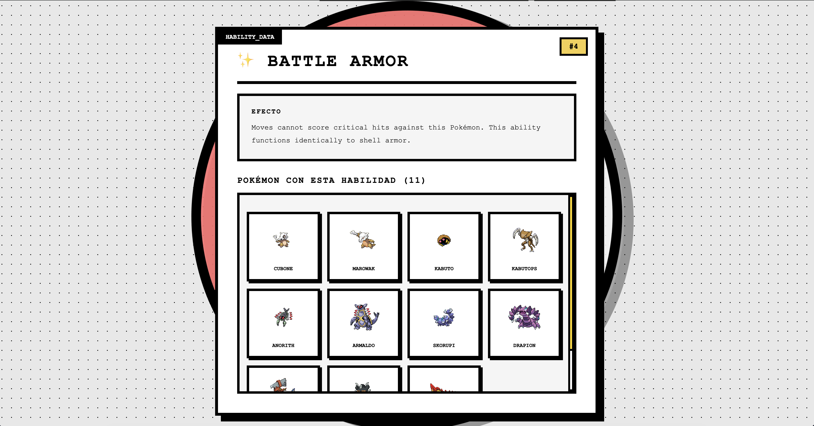
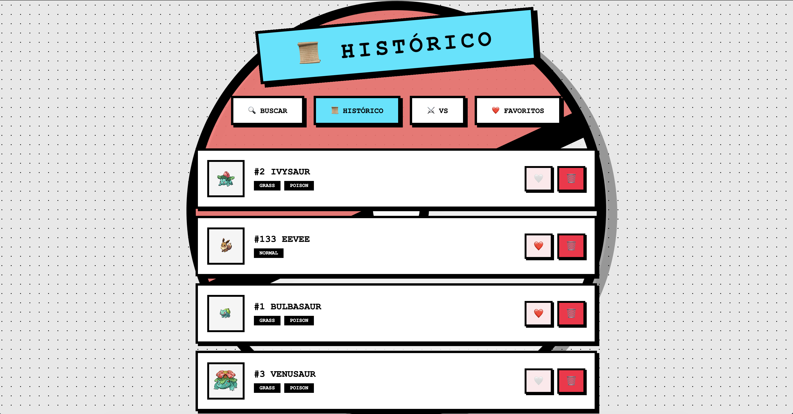
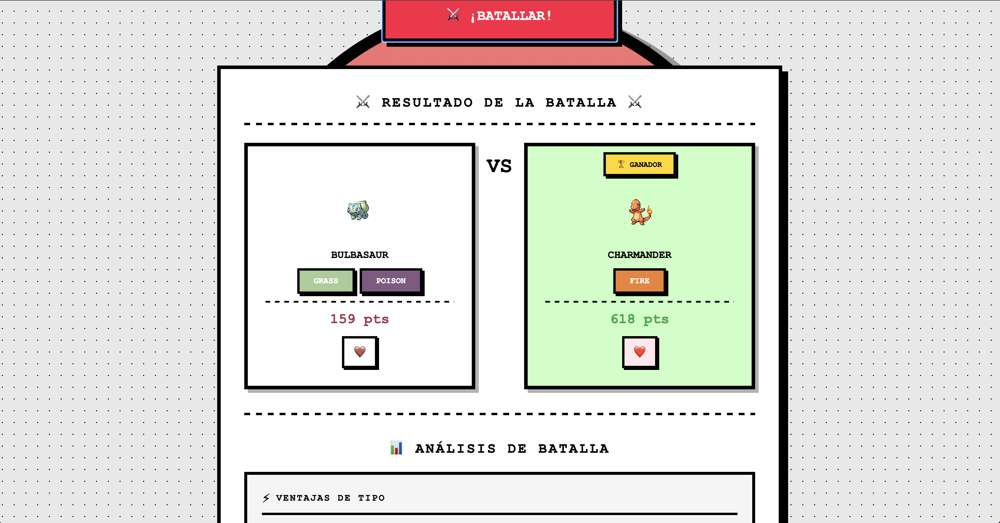

# 🎮 PokéFinder - Aplicación Web de Búsqueda y Comparación de Pokémon

## 👤 Autor
**Nombre del Estudiante:** Jonatan Vergara  
**Carrera:** Ingeniería de Software  
**Institución:** [Tu Universidad]  
**Fecha:** Diciembre 2025

---

## 📖 Descripción del Proyecto

**PokéFinder** es una aplicación web interactiva que permite a los usuarios buscar, explorar y comparar Pokémon utilizando la **PokeAPI**. La aplicación incorpora un diseño **Brutalist** con bordes gruesos, colores vibrantes y una experiencia de usuario intuitiva.

### Características Principales
- 🔍 Búsqueda por nombre o ID de Pokémon
- ⚡ Búsqueda por Habilidad
- 🧬 Cadena Evolutiva completa
- ⚔️ Sistema VS para comparar dos Pokémon
- 📜 Histórico de búsquedas
- ❤️ Sistema de Favoritos
- 💾 Caché inteligente con TTL (24 horas)
- 🎨 Diseño Brutalist responsivo

---

## 🌐 Link a Demostración en Vivo

**GitHub Pages:** https://arthurink.github.io/Poke-Finder/

---

## 🚀 Instrucciones de Uso

### Requisitos
- Navegador moderno (Chrome, Firefox, Safari, Edge)
- Conexión a Internet (para consumir PokeAPI)

### Instalación Local

```bash
# 1. Clonar el repositorio
git clone https://github.com/tuusuario/vergara-jonatan.git
cd vergara-jonatan/semestral

# 2. Abrir en navegador (sin servidor necesario)
# Opción A: Doble clic en index.html
# Opción B: Usar Live Server de VS Code
#           Instalar extensión "Live Server"
#           Click derecho en index.html → "Open with Live Server"

# Opción C: Usar Python local
python -m http.server 8000
# Luego visita: http://localhost:8000
```

### Navegación de la Aplicación

#### 1. **🔍 Búsqueda (index.html)**
- Selecciona **"Pokémon"** o **"Habilidad"** en el selector
- Ingresa el nombre o ID del Pokémon/Habilidad
- Presiona **"BUSCAR"** o la tecla **Enter**
- Visualiza los detalles, estadísticas y cadena evolutiva
- Click en una habilidad para buscarla
- Click en una evolución para ver ese Pokémon

**Indicadores:**
- 🌐 DESDE API = datos recién obtenidos
- 📦 DESDE CACHÉ = datos guardados (más rápido)

#### 2. **📜 Histórico (historico.html)**
- Ver todos los Pokémon buscados (más reciente primero)
- 🤍 Marcar como favorito
- 🗑️ Eliminar individual
- **"BORRAR TODO"** para limpiar histórico y caché

#### 3. **❤️ Favoritos (favoritos.html)**
- Ver lista de Pokémon marcados como favoritos
- 🗑️ Eliminar individual
- **"BORRAR TODO"** para vaciar favoritos
- Click en item para ver detalles del Pokémon

#### 4. **⚔️ VS Battle (vs.html)**
- Ingresa **Pokémon 1** y **Pokémon 2**
- Presiona **"¡BATALLAR!"**
- Visualiza:
  - 🏆 Ganador determinado por stats totales + efectividad de tipos
  - 📊 Comparación visual de estadísticas (HP, ATK, DEF, etc.)
  - ⚡ Ventajas de tipo
  - 🧮 Desglose del cálculo de puntaje
- Marca como favorito desde la vista de batalla

---

## 📸 Capturas de Pantalla

### [1] Búsqueda Principal


### [2] Cadena Evolutiva


### [3] Búsqueda por Habilidad


### [4] Histórico


### [5] Favoritos


### [6] VS Battle


---

## 🛠️ Estructura del Proyecto

```
📁 semestral/
├── 📄 index.html              # Página de búsqueda principal
├── 📄 historico.html          # Página de histórico
├── 📄 favoritos.html          # Página de favoritos
├── 📄 vs.html                 # Página de VS Battle
├── 🎨 shared.css              # Estilos compartidos (Brutalist)
├── 📜 shared.js               # Lógica JavaScript (módulo IIFE)
├── 📖 README.md               # Este documento (entregable)
└── 📁 screenshots/            # Carpeta para capturas
    ├── 1-busqueda.png
    ├── 2-evolucion.png
    ├── 3-habilidad.png
    ├── 4-historico.png
    ├── 5-favoritos.png
    └── 6-vs-battle.png
```

---

## 💻 Tecnologías Utilizadas

| Tecnología | Propósito |
|-----------|-----------|
| **HTML5** | Maquetación semántica |
| **CSS3** | Diseño Brutalist (Flexbox, Grid, Variables CSS) |
| **JavaScript (ES6+)** | Lógica, manipulación DOM, consumo de API |
| **Fetch API** | Comunicación con PokeAPI |
| **localStorage** | Persistencia (caché, histórico, favoritos) |
| **IIFE Pattern** | Organización modular de código |

---

## 🔌 API Consumida

**PokeAPI:** https://pokeapi.co/api/v2/

### Endpoints Utilizados

| Endpoint | Propósito |
|----------|-----------|
| `/pokemon/{name or id}` | Datos base del Pokémon (stats, tipos, habilidades) |
| `/pokemon-species/{id}` | Información de especie (cadena evolutiva ID) |
| `/evolution-chain/{id}` | Cadena evolutiva completa con condiciones |
| `/ability/{name or id}` | Detalles de habilidad (nombre, descripción, Pokémon) |

---

## 🎨 Características de Diseño

### Estilo Brutalist
- ✅ Bordes gruesos (4px sólidos negros)
- ✅ Sombras duras (6px offset, sin blur)
- ✅ Tipografía monoespaciada (Courier New)
- ✅ Colores vibrantes y contrastantes
- ✅ Efectos de presión en botones (transform con hover/active)
- ✅ Sin bordes redondeados excesivos (máximo 4-8px)

### Paleta de Colores
- **Primario:** #2d2d2d (Negro oscuro)
- **Secundario:** #ff6b6b (Rojo coral)
- **Acento:** #ffcc00 (Amarillo Pokémon)
- **Success:** #4ecdc4 (Verde agua)
- **Background:** #f5e6d3 (Beige claro)

### Responsividad
- ✅ Adaptada a pantallas móviles (< 768px)
- ✅ Tabletas (768px - 1024px)
- ✅ Desktop (> 1024px)
- ✅ Navegación intuitiva en todos los dispositivos

---

## 🚨 Características Destacadas

### ⚡ Sistema de Caché Inteligente
- TTL de 24 horas (86,400 segundos)
- Almacenamiento en localStorage
- Badge indicador:
  - 🌐 **DESDE API** = datos recién obtenidos
  - 📦 **DESDE CACHÉ** = datos guardados (más rápido)
- Limpieza manual desde página de histórico
- Limpieza automática de caché expirado

### 📊 VS Battle Avanzado
- **Cálculo de puntuación** basado en:
  - Stats base totales (HP + ATK + DEF + SP.ATK + SP.DEF + SPD)
  - Multiplicador de efectividad de tipos (2x si super efectivo, 0.5x si poco efectivo)
- **Comparación visual** de 6 estadísticas
  - Nombres abreviados (HP, ATK, DEF, SP.ATK, SP.DEF, SPD)
  - Barras centradas que parten desde el centro
  - Números en negro, rojo para el más alto
- **Análisis de ventajas/desventajas** por tipo
- Determinación automática de ganador

### 🧬 Cadena Evolutiva Completa
- Encadenamiento inteligente:
  - Una sola evolución: en la misma línea con flecha
  - Múltiples evoluciones: salto a siguiente fila
- Sprites de cada etapa
- Condiciones de evolución (Nv. X, Item específico, Intercambio, Emplazamiento, etc.)
- Flechas rojas (→) conectando etapas
- Click en evolución busca automáticamente ese Pokémon

### ❤️ Sistema de Favoritos Persistente
- Almacenamiento en localStorage
- Sincronización automática entre páginas
- Corazón rojo (❤️) indicador
- Agregar/quitar desde búsqueda, histórico, favoritos y VS battle

---

## ✅ Checklist de Funcionalidades

### Nivel Básico (60 pts) ✅
- [x] Búsqueda por nombre o ID
- [x] Visualización de tarjeta (imagen, tipos, stats)
- [x] Sistema de caché (24h TTL)
- [x] Badge de origen (API/CACHÉ)
- [x] Histórico de búsquedas (últimos 50)
- [x] Sistema de favoritos persistente

### Nivel Intermedio (25 pts) ✅
- [x] Cadena evolutiva completa
- [x] Búsqueda por habilidad
- [x] Lista de Pokémon con habilidad
- [x] Descripción de habilidad en español

### Nivel Avanzado (15 pts) ✅
- [x] VS Battle comparador
- [x] Comparación visual de stats
- [x] Sistema de efectividad de tipos
- [x] Determinación automática de ganador

---

## 📝 Notas de Desarrollo

### Optimizaciones Implementadas
- ✅ Caché inteligente para reducir peticiones API (< 10 peticiones por sesión típicamente)
- ✅ Event delegation para eficiencia de listeners
- ✅ Lazy loading de evoluciones (cargan bajo demanda)
- ✅ Módulo IIFE para evitar contaminación global
- ✅ Compresión de sprites (uso de URLs optimizadas)

### Desafíos Resueltos
- ✅ Mapeo correcto de efectividad de tipos (18 tipos × 3 efectos = 54 relaciones)
- ✅ Encadenamiento de evoluciones (línea única vs. múltiples filas)
- ✅ Sincronización de favoritos en múltiples páginas
- ✅ Manejo robusto de errores de API
- ✅ Traducción de descripciones de habilidades (español como primario)

---

## 🤝 Contribuciones y Mejoras Futuras

- [ ] Tema oscuro/claro con toggle
- [ ] Autocompletado en búsqueda (con dropdown)
- [ ] Sonidos de Pokémon al buscar
- [ ] Exportar favoritos (JSON/CSV)
- [ ] Filtros por tipo, generación, región
- [ ] Estadísticas y análisis avanzados
- [ ] Modo multijugador online
- [ ] Movimientos y ataques de Pokémon

---

## 📞 Contacto y Soporte

**Repositorio GitHub:** https://github.com/Arthurink/vergara-jonatan

**GitHub Pages (Demostración en Vivo):** https://arthurink.github.io/Poke-Finder/

**Email:** jonatan.vergara@utp.ac.pa

---

## 📄 Licencia

Este proyecto fue desarrollado como parte de evaluación académica en la materia [Nombre de la Materia].  
Derechos reservados © 2025 Jonatan Vergara.

**¡Gracias por usar PokéFinder! ⚡🔥💧**  
**¡Que disfrutes comparando y atrapando Pokémon! 🎮**
